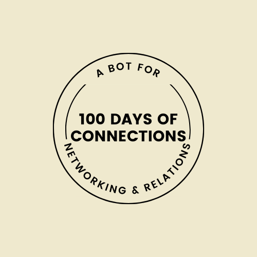

[![MIT License][license-shield]][license-url]
[![LinkedIn][linkedin-shield]][linkedin-url]


<!-- PROJECT LOGO -->
<br />
<div align="center">
  <a href="https://github.com/bluzeey/100daysofconnection-twitter-bot">
    
  </a>

<h3 align="center">100DaysOfConnection</h3>

  <p align="center">
    This is a twitter bot which works like 100 days of code, but it is for networking and connections.
    <br />
    <a href="https://github.com/bluzeey/netflix-clone"><strong>Explore the docs »</strong></a>
    <br />
    <br />
    <a href="https://netflix-v2.netlify.app/">View Demo</a>
    ·
    <a href="https://github.com/bluzeey/netflix-clone/issues">Report Bug</a>
    ·
    <a href="https://github.com/bluzeey/netflix-clone/issues">Request Feature</a>
  </p>
</div>


<!-- TABLE OF CONTENTS -->
<details>
  <summary>Table of Contents</summary>
  <ol>
    <li>
      <a href="#about-the-project">About The Project</a>
      <ul>
        <li><a href="#built-with">Built With</a></li>
      </ul>
    </li>
    <li>
      <a href="#getting-started">Getting Started</a>
      <ul>
        <li><a href="#prerequisites">Prerequisites</a></li>
        <li><a href="#installation">Installation</a></li>
      </ul>
    </li>
    <li><a href="#usage">Usage</a></li>
    <li><a href="#roadmap">Roadmap</a></li>
    <li><a href="#contributing">Contributing</a></li>
    <li><a href="#license">License</a></li>
    <li><a href="#contact">Contact</a></li>
    <li><a href="#acknowledgments">Acknowledgments</a></li>
  </ol>
</details>


<!-- ABOUT THE PROJECT -->
## 100DaysofConnection Twitter Bot

[![100DaysofConnection][product-screenshot]](https://netflix-v2.netlify.app/)


<p align="right">(<a href="#top">back to top</a>)</p>


### Built With

* [Node.js](https://nodejs.org/)

<p align="right">(<a href="#top">back to top</a>)</p>


<!-- GETTING STARTED -->
## Getting Started

For installing the application, you will have to follow the steps mentioned below:

### Prerequisites

This is an example of how to list things you need to use the software and how to install them.
* npm
  ```sh
  npm install npm@latest -g
  ```

### Installation

1. Clone the repo
   ```sh
   git clone https://github.com/bluzeey/100daysofconnection-twitter-bot
   ```
2. Install NPM packages
   ```sh
   npm install
   ```
3. Enter your API in `config.js`
   ```js
   consumer_key: process.env.CONSUMER_KEY,
   consumer_secret: process.env.CONSUMER_SECRET,
   access_token: process.env.ACCESS_TOKEN,
   access_token_secret: process.env.ACCESS_TOKEN_SECRET,
   ```

<p align="right">(<a href="#top">back to top</a>)</p>


<!-- USAGE EXAMPLES -->
## Usage

This netflix clone is a demo .It has login functionalites and video-playing embedded. 


<p align="right">(<a href="#top">back to top</a>)</p>


<!-- LICENSE -->
## License

Distributed under the MIT License. See `LICENSE.txt` for more information.

<p align="right">(<a href="#top">back to top</a>)</p>


<!-- CONTACT -->
## Contact

Sahil Maheshwari - [@TalkinIdeas](https://twitter.com/TalkinIdeas) - sahilm1711@gmail.com

Project Link: [NetflixV2](https://netflix-v2.netlify.app/)

<p align="right">(<a href="#top">back to top</a>)</p>


<!-- ACKNOWLEDGMENTS -->
## Acknowledgments

* [Aman Mittal](https://twitter.com/amanhimself)

<p align="right">(<a href="#top">back to top</a>)</p>


<!-- MARKDOWN LINKS & IMAGES -->
<!-- https://www.markdownguide.org/basic-syntax/#reference-style-links -->
[license-shield]: https://img.shields.io/github/license/bluzeey/whatsapp-clone.svg?style=for-the-badge
[license-url]: https://github.com/bluzeey/whatsapp-clone/blob/main/LICENSE.txt
[linkedin-shield]: https://img.shields.io/badge/LinkedIn-0077B5?style=for-the-badge&logo=linkedin&logoColor=white
[linkedin-url]: https://linkedin.com/in/sahil-maheshwari
[product-screenshot]: 100DaysofConnectionScreenshot.PNG
